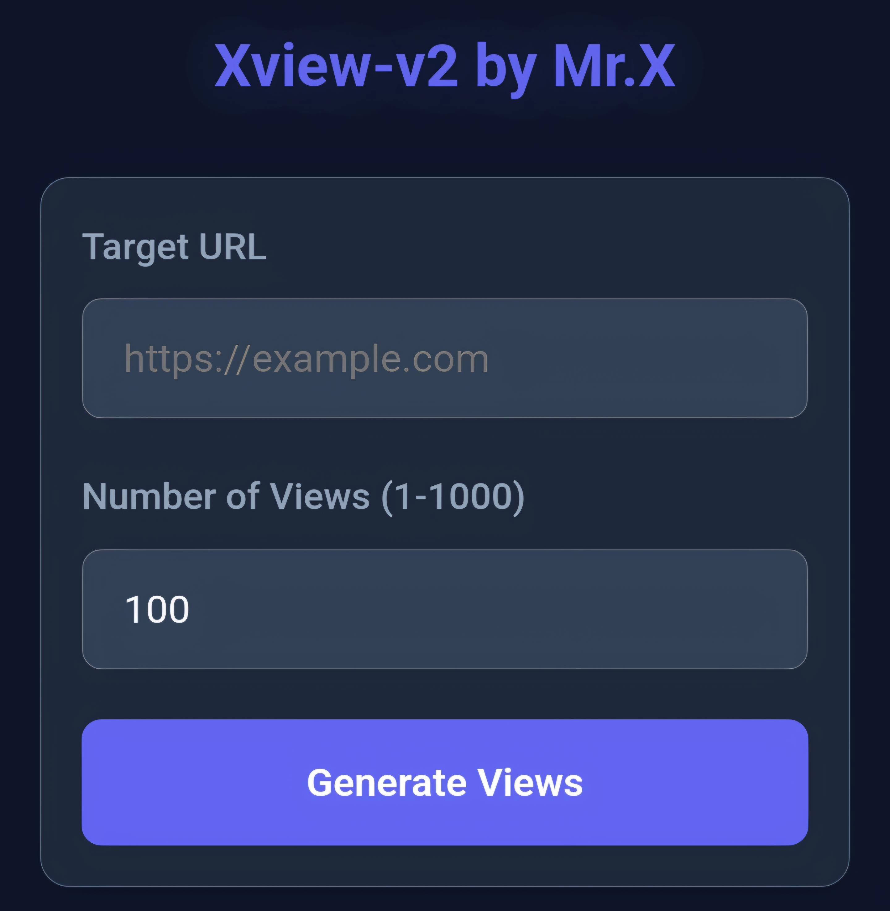

# Xview-v2 


## introduction
**Xview-v2** is a tool used to increase website views or traffic from a website without limits and can be repeated many times by using a localhost network for hosting.this version provides a web interface for simulating and analyzing website visits through various user agents and referrers. This project is designed for educational purposes and web traffic simulation.

## Instalations
```
$ pkg update -y && pkg upgrade -y
$ apt update -y && apt upgrade -y
$ pkg install git
$ pkg install python -y
$ pkg install php -y
$ git clone https://github.com/Whomrx666/Xview-v2.git
$ cd Xview-v2 
$ pip install -r requirements.txt
$ python Xview-v2.py
```

## Instructions
- **first**: Install tools according to the instructions above
- **second**: Enter the tools with the last command
- **third**: After you enter, copy the hosting that says http://127.0.0.1:8080
- **fourth**: After you copy it, you can go to any browser you like, then copy and paste it into the hosting browser
- **last**: After that, you will enter the tools display in the browser and all you have to do is enter the website that you want to add views or traffic to and you determine the maximum number of visitors to 1000

# Hosting that you have to copy!


## Features

- Web-based interface for managing simulated visits.
- Dynamic user agents and referrer injection for realistic results.
- Progress tracking and detailed logs for each visit.
- Responsive design for mobile and desktop browsers.

## Observation
This is a tool for education only, I am not responsible for any misuse
### Original Author
<a href="https://github.com/Whomrx666"></a>

### <<< If you copy , Then Give me The Credits >>>

## CONNECT WITH ME :

[](https://whomrxhackers.blogspot.com/)
[](https://twitter.com/whomrx666)
[](https://wa.me/6285926601133?text=Halo%2C%20Mr.X)
[](https://www.facebook.com/whomrx.666)
[](https://t.me/Whomr_X)
[](mailto:whomrx666@gmail.com)
[](https://www.tiktok.com/@whomr.x)

**If you want to donate, click on the button**
<a href="https://saweria.co/whomrx"></a>

---

<p align="left">
  
</p>

---